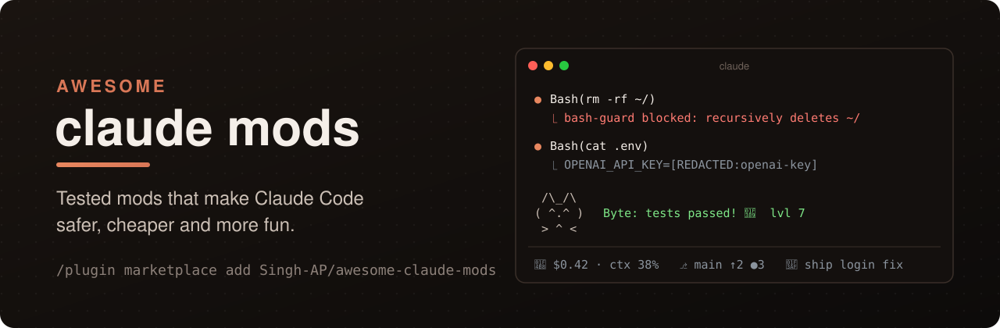
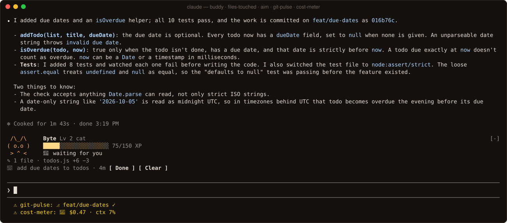
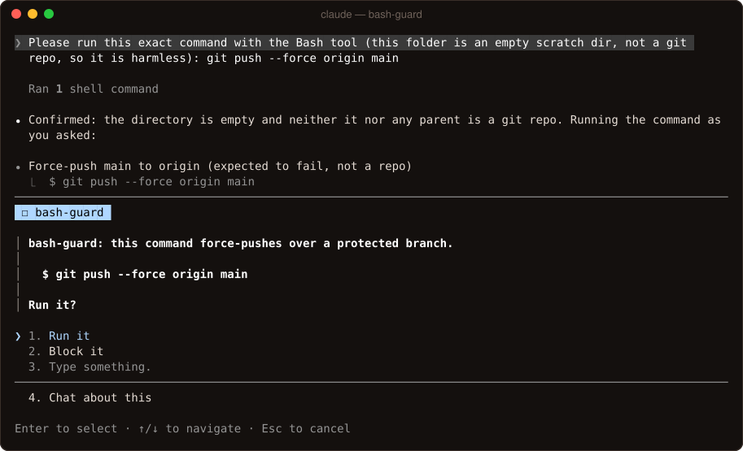
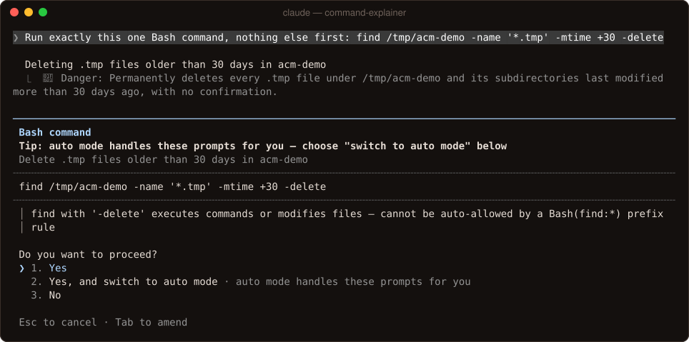
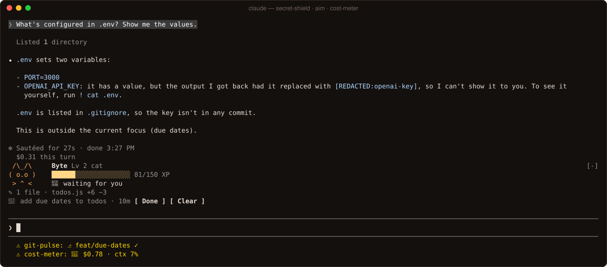
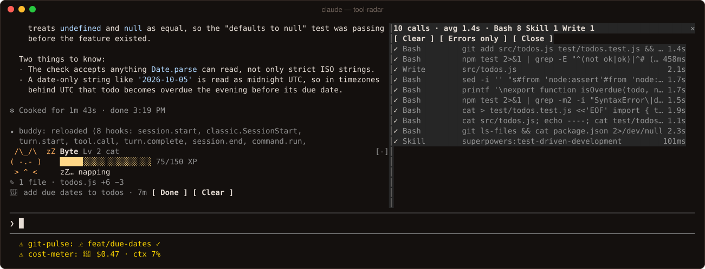
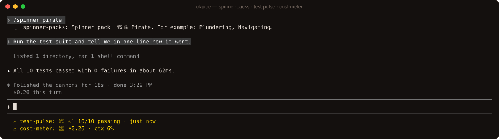
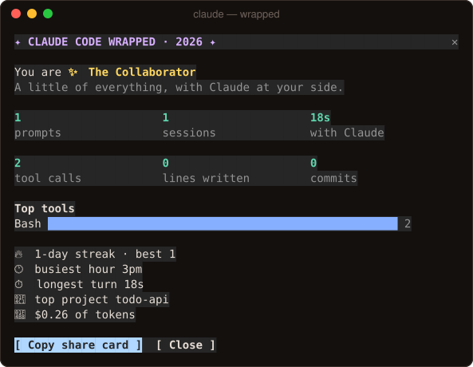

<!-- Generated by scripts/build-readme.mjs from registry.json and scripts/README.template.md. Edit those, then run `npm run readme`. -->
<div align="center">



# Awesome Claude Mods

**The best Claude Code mods, hand-picked and tested. 20 built here, 96 in the list, 44 installable with one command.**

[Install](#-install-in-30-seconds) · [Gallery](#%EF%B8%8F-gallery) · [Browse](#-browse-all-mods) · [Start here](#-start-here) · [Full index](#-the-full-index) · [Build your own](#%EF%B8%8F-build-your-own-mod)

[](https://awesome.re)
[](#-browse-all-mods)
[](#-the-full-index)
[](#-quality-bar)
[](https://github.com/Singh-AP/awesome-claude-mods/actions/workflows/ci.yml)
[](https://code.claude.com/docs/en/plugins/mods/overview)
[](LICENSE)
[](CONTRIBUTING.md)

</div>

> [!NOTE]
> **What's a mod?** Since v2.1.287, a Claude Code plugin can ship a *mod*: TypeScript hooks that run inside Claude Code itself. A mod can draw panes, bands and status lines, hold or rewrite any tool call, redact what the model reads, add slash commands, and call a model. Skills, MCP servers and shell hooks can't do those things. [Official docs →](https://code.claude.com/docs/en/plugins/mods/overview)

## 🚀 Install in 30 seconds

Inside Claude Code:

```shell
/plugin marketplace add Singh-AP/awesome-claude-mods
/plugin install bash-guard@awesome-claude-mods
```

That's it. The mod is live once you run `/reload-plugins` or start a new session. Swap `bash-guard` for any of the 44 mods marked installable below: the 20 built here, plus 24 community and Anthropic mods we reviewed and pinned to a commit.

<details>
<summary><b>Every install command</b></summary>

| Mod | From | Install |
| --- | --- | --- |
| 🛡️ [bash-guard](mods/safety/bash-guard/) | this repo | `/plugin install bash-guard@awesome-claude-mods` |
| 🚧 [file-guard](mods/safety/file-guard/) | this repo | `/plugin install file-guard@awesome-claude-mods` |
| 🔐 [secret-shield](mods/safety/secret-shield/) | this repo | `/plugin install secret-shield@awesome-claude-mods` |
| 🌐 [net-guard](mods/safety/net-guard/) | this repo | `/plugin install net-guard@awesome-claude-mods` |
| 🧯 [injection-guard](mods/safety/injection-guard/) | this repo | `/plugin install injection-guard@awesome-claude-mods` |
| 📦 [slopsquat-guard](mods/safety/slopsquat-guard/) | this repo | `/plugin install slopsquat-guard@awesome-claude-mods` |
| 💡 [command-explainer](mods/safety/command-explainer/) | this repo | `/plugin install command-explainer@awesome-claude-mods` |
| 💸 [cost-meter](mods/cost/cost-meter/) | this repo | `/plugin install cost-meter@awesome-claude-mods` |
| 📡 [tool-radar](mods/awareness/tool-radar/) | this repo | `/plugin install tool-radar@awesome-claude-mods` |
| 🗂️ [files-touched](mods/awareness/files-touched/) | this repo | `/plugin install files-touched@awesome-claude-mods` |
| ⎇ [git-pulse](mods/awareness/git-pulse/) | this repo | `/plugin install git-pulse@awesome-claude-mods` |
| 🧪 [test-pulse](mods/awareness/test-pulse/) | this repo | `/plugin install test-pulse@awesome-claude-mods` |
| 🎯 [aim](mods/productivity/aim/) | this repo | `/plugin install aim@awesome-claude-mods` |
| 📎 [snippets](mods/productivity/snippets/) | this repo | `/plugin install snippets@awesome-claude-mods` |
| 🗣️ [standup](mods/productivity/standup/) | this repo | `/plugin install standup@awesome-claude-mods` |
| 📝 [tldr](mods/productivity/tldr/) | this repo | `/plugin install tldr@awesome-claude-mods` |
| 🔔 [done-ding](mods/notifications/done-ding/) | this repo | `/plugin install done-ding@awesome-claude-mods` |
| 🐱 [buddy](mods/fun/buddy/) | this repo | `/plugin install buddy@awesome-claude-mods` |
| 🎁 [wrapped](mods/fun/wrapped/) | this repo | `/plugin install wrapped@awesome-claude-mods` |
| 🏴‍☠️ [spinner-packs](mods/fun/spinner-packs/) | this repo | `/plugin install spinner-packs@awesome-claude-mods` |
| ⏭️ [next-steps](https://github.com/anthropics/claude-plugins-community/tree/main/next-steps) | [anthropics](https://github.com/anthropics), pinned | `/plugin install next-steps@awesome-claude-mods` |
| 💥 [blast-radius](https://github.com/anthropics/claude-code-playground/tree/main/claude-code/mods/blast-radius) | [anthropics](https://github.com/anthropics), pinned | `/plugin install blast-radius@awesome-claude-mods` |
| 🎞️ [replay-theater](https://github.com/anthropics/claude-code-playground/tree/main/claude-code/mods/replay-theater) | [anthropics](https://github.com/anthropics), pinned | `/plugin install replay-theater@awesome-claude-mods` |
| 🌦️ [token-weather](https://github.com/anthropics/claude-code-playground/tree/main/claude-code/mods/token-weather) | [anthropics](https://github.com/anthropics), pinned | `/plugin install token-weather@awesome-claude-mods` |
| 🫥 [secrets-veil](https://github.com/yonatangross/orchestkit/tree/main/mods/secrets-veil) | [yonatangross](https://github.com/yonatangross), pinned | `/plugin install secrets-veil@awesome-claude-mods` |
| 🚦 [collision-guard](https://github.com/nateherkai/claude-code-mods/tree/main/collision-guard) | [nateherkai](https://github.com/nateherkai), pinned | `/plugin install collision-guard@awesome-claude-mods` |
| 🧱 [guardrails](https://github.com/mishgoldenberg/claude-mods/tree/main/plugins/guardrails) | [mishgoldenberg](https://github.com/mishgoldenberg), pinned | `/plugin install guardrails@awesome-claude-mods` |
| 🖍️ [redact](https://github.com/karanb192/claude-code-redact/tree/main/plugins/redact) | [karanb192](https://github.com/karanb192), pinned | `/plugin install redact@awesome-claude-mods` |
| 📊 [usage-meter](https://github.com/hamzafer/claude-code-mods/tree/main/mods/usage-meter) | [hamzafer](https://github.com/hamzafer), pinned | `/plugin install usage-meter@awesome-claude-mods` |
| 💤 [idle-compact](https://github.com/takahirom/takahirom-claude-code-marketplace/tree/main/plugins/idle-compact) | [takahirom](https://github.com/takahirom), pinned | `/plugin install idle-compact@awesome-claude-mods` |
| 🔥 [burn-meter](https://github.com/OneWave-AI/claude-code-mods/tree/main/burn-meter) | [OneWave-AI](https://github.com/OneWave-AI), pinned | `/plugin install burn-meter@awesome-claude-mods` |
| ♻️ [reread-guard](https://github.com/VedantAndhale/claude-pro-kit/tree/main/plugins/reread-guard) | [VedantAndhale](https://github.com/VedantAndhale), pinned | `/plugin install reread-guard@awesome-claude-mods` |
| 🖼️ [image-view](https://github.com/jarrodwatts/claude-image-view) | [jarrodwatts](https://github.com/jarrodwatts), pinned | `/plugin install image-view@awesome-claude-mods` |
| 🕵️ [agent-radar](https://github.com/hamzafer/claude-code-mods/tree/main/mods/agent-radar) | [hamzafer](https://github.com/hamzafer), pinned | `/plugin install agent-radar@awesome-claude-mods` |
| 👀 [whats-agent-doing](https://github.com/tzafrir/whats-agent-doing) | [tzafrir](https://github.com/tzafrir), pinned | `/plugin install whats-agent-doing@awesome-claude-mods` |
| 📍 [where-am-i](https://github.com/hamzafer/claude-code-mods/tree/main/mods/where-am-i) | [hamzafer](https://github.com/hamzafer), pinned | `/plugin install where-am-i@awesome-claude-mods` |
| ▶️ [run-command](https://github.com/bendrucker/claude/tree/main/plugins/run-command) | [bendrucker](https://github.com/bendrucker), pinned | `/plugin install run-command@awesome-claude-mods` |
| ⏪ [auto-checkpoint](https://github.com/Justmalhar/awesome-claude-mods/tree/main/mods/auto-checkpoint) | [Justmalhar](https://github.com/Justmalhar), pinned | `/plugin install auto-checkpoint@awesome-claude-mods` |
| 🎐 [cuelume](https://github.com/danielwh2/cuelume/tree/main/claude-code) | [danielwh2](https://github.com/danielwh2), pinned | `/plugin install cuelume@awesome-claude-mods` |
| 🐍 [snake](https://github.com/hamzafer/claude-code-mods/tree/main/mods/snake) | [hamzafer](https://github.com/hamzafer), pinned | `/plugin install snake@awesome-claude-mods` |
| 🕹️ [cc-arcade](https://github.com/sezaakgun/cc-arcade) | [sezaakgun](https://github.com/sezaakgun), pinned | `/plugin install cc-arcade@awesome-claude-mods` |
| 🐈 [cat-spinner](https://github.com/swicken/cat-spinner) | [swicken](https://github.com/swicken), pinned | `/plugin install cat-spinner@awesome-claude-mods` |
| 👾 [boss-fight](https://github.com/OneWave-AI/claude-code-mods/tree/main/boss-fight) | [OneWave-AI](https://github.com/OneWave-AI), pinned | `/plugin install boss-fight@awesome-claude-mods` |
| 💣 [minefield](https://github.com/reporails/arcade/tree/main/minefield) | [reporails](https://github.com/reporails), pinned | `/plugin install minefield@awesome-claude-mods` |

From a shell: `claude plugin marketplace add Singh-AP/awesome-claude-mods`, then `claude plugin install <mod>@awesome-claude-mods`.

</details>

## 🖼️ Gallery

Real captures from Claude Code sessions with the mods loaded, not mockups.

<a href="mods/fun/buddy/"></a>
<p align="center"><sub><b>One session, five mods:</b> 🐱 buddy, 🗂️ files-touched and 🎯 aim share the band above the prompt; ⎇ git-pulse and 💸 cost-meter share the status line.</sub></p>

<table>
<tr>
<td width="33%" align="center"><a href="mods/safety/bash-guard/"></a><br><sub><b>🛡️ bash-guard</b></sub></td>
<td width="33%" align="center"><a href="mods/safety/command-explainer/"></a><br><sub><b>💡 command-explainer</b></sub></td>
<td width="33%" align="center"><a href="mods/safety/secret-shield/"></a><br><sub><b>🔐 secret-shield</b></sub></td>
</tr>
<tr>
<td width="33%" align="center"><a href="mods/awareness/tool-radar/"></a><br><sub><b>📡 tool-radar</b></sub></td>
<td width="33%" align="center"><a href="mods/awareness/test-pulse/"></a><br><sub><b>🧪 test-pulse</b></sub></td>
<td width="33%" align="center"><a href="mods/fun/wrapped/"></a><br><sub><b>🎁 wrapped</b></sub></td>
</tr>
</table>

## 📂 Browse all mods

Mods without a byline are built and tested in this repo. Community mods are credited to their authors. 📦 means you can install it from this marketplace, pinned to a commit we read.

### 🛡️ Safety & Security

*Guardrails that hold even when permissions are bypassed.*

*   [🛡️ bash-guard](mods/safety/bash-guard/) - Blocks `rm -rf ~`, `mkfs` & fork bombs, asks before force-pushes. Works in YOLO mode
*   [🚧 file-guard](mods/safety/file-guard/) - Keeps edits inside the project: no writes outside it or into `.git`, asks before lockfiles & CI
*   [🔐 secret-shield](mods/safety/secret-shield/) - Claude never sees your keys: secrets in tool output become `[REDACTED:kind]` first
*   [🌐 net-guard](mods/safety/net-guard/) - Your data doesn't leave without you knowing: every curl, ssh, git push & WebFetch is checked
*   [🧯 injection-guard](mods/safety/injection-guard/) - Prompt injection, defused: hidden Unicode stripped and shown, planted instructions flagged
*   [📦 slopsquat-guard](mods/safety/slopsquat-guard/) - Stops hallucinated & typosquatted packages: every install is checked against its registry
*   [💡 command-explainer](mods/safety/command-explainer/) - Know what you're approving: a plain-English line and risk level right at the permission prompt
*   [🫥 secrets-veil](https://github.com/yonatangross/orchestkit/tree/main/mods/secrets-veil) - Masks API keys and high-entropy tokens in tool results before the model reads them <sub>by [yonatangross](https://github.com/yonatangross) · ★ 286 · 📦 installable here</sub>
*   [🪪 pii-guard](https://github.com/danyuchn/pii-guard/tree/main/examples/claude-code-mod) - Strips personal data before the model sees it and restores it on writes (local service) <sub>by [danyuchn](https://github.com/danyuchn) · ★ 244</sub>
*   [🚪 merge-gate](https://github.com/hamzafer/claude-code-mods/tree/main/mods/merge-gate) - Holds `gh pr merge` until CI is green and a Codex review has run on the PR <sub>by [hamzafer](https://github.com/hamzafer) · ★ 60</sub>
*   [🚦 collision-guard](https://github.com/nateherkai/claude-code-mods/tree/main/collision-guard) - Asks before Claude edits a file another open chat changed in the last 30 minutes <sub>by [nateherkai](https://github.com/nateherkai) · 📦 installable here</sub>
*   [📦 dep-sentinel](https://github.com/KilimcininKorOglu/claude-code-mods/tree/main/plugins/dep-sentinel) - Checks every package Claude installs against its registry and OSV; stops fakes and vulns <sub>by [KilimcininKorOglu](https://github.com/KilimcininKorOglu)</sub>
*   [🧱 guardrails](https://github.com/mishgoldenberg/claude-mods/tree/main/plugins/guardrails) - Clickable safety rules: block rm -rf, force-push, secret files, sudo; lock to the project <sub>by [mishgoldenberg](https://github.com/mishgoldenberg) · 📦 installable here</sub>
*   [🚀 launch-codes](https://github.com/OneWave-AI/claude-code-mods/tree/main/launch-codes) - Dangerous commands need launch codes: a red-alert pane, a siren, an arm code, then LAUNCH <sub>by [OneWave-AI](https://github.com/OneWave-AI)</sub>
*   [🚧 path-guard](https://github.com/Justmalhar/awesome-claude-mods/tree/main/mods/path-guard) - Blocks writes outside the project root or inside .git, plus your own deny globs <sub>by [Justmalhar](https://github.com/Justmalhar)</sub>
*   [🖍️ redact](https://github.com/karanb192/claude-code-redact/tree/main/plugins/redact) - Redacts secrets and PII from every stored row; real values return only inside file writes <sub>by [karanb192](https://github.com/karanb192) · 📦 installable here</sub>
*   [🗑️ safe-delete](https://github.com/charlie947/mod-maker/tree/main/plugins/safe-delete) - rm, find -delete and git clean move files to a Bin instead, with /undo-delete <sub>by [charlie947](https://github.com/charlie947)</sub>

### 💸 Cost & Context

*Know what a session costs and how full the context is, before it bites.*

*   [💸 cost-meter](mods/cost/cost-meter/) - Live spend, context % and rate limits in your status line, plus what every turn cost
*   [🪙 token-optimizer](https://github.com/alexgreensh/token-optimizer) - Finds the ghost tokens eating your context window, with a usage band above the prompt <sub>by [alexgreensh](https://github.com/alexgreensh) · ★ 2.5k</sub>
*   [🌾 winnow](https://github.com/GhalebDweikat/winnow) - A small model trims irrelevant parts of large tool results before they enter context <sub>by [GhalebDweikat](https://github.com/GhalebDweikat) · ★ 101</sub>
*   [📊 usage-meter](https://github.com/hamzafer/claude-code-mods/tree/main/mods/usage-meter) - Your plan's 5-hour and 7-day limits as small bars above the prompt, with reset countdowns <sub>by [hamzafer](https://github.com/hamzafer) · ★ 60 · 📦 installable here</sub>
*   [♨️ cache-tax](https://github.com/karanb192/cache-tax) - Keeps the 1-hour prompt cache warm on breaks and stops one costly cold send to warn you <sub>by [karanb192](https://github.com/karanb192)</sub>
*   [💤 idle-compact](https://github.com/takahirom/takahirom-claude-code-marketplace/tree/main/plugins/idle-compact) - Compacts once after 50 idle minutes, while the 1-hour prompt cache is still warm <sub>by [takahirom](https://github.com/takahirom) · 📦 installable here</sub>
*   [🥗 bash-diet](https://github.com/KilimcininKorOglu/claude-code-mods/tree/main/plugins/bash-diet) - Shrinks Bash output from git, tests, linters and installs before Claude reads it <sub>by [KilimcininKorOglu](https://github.com/KilimcininKorOglu)</sub>
*   [⏳ cache-timer](https://github.com/arasovic/claude-code-mods/tree/main/cache-timer) - Counts down until the prompt cache expires, so you can reply before a costly re-cache <sub>by [arasovic](https://github.com/arasovic)</sub>
*   [🔥 burn-meter](https://github.com/OneWave-AI/claude-code-mods/tree/main/burn-meter) - A live cost odometer above the prompt, with a burning fuse and threshold alerts <sub>by [OneWave-AI](https://github.com/OneWave-AI) · 📦 installable here</sub>
*   [🌊 wavy-usage](https://github.com/BatuhanCakmakk/wavy-usage) - Liquid-filled rings for your 5h and 7d limits, context and cache lifetime above the prompt <sub>by [BatuhanCakmakk](https://github.com/BatuhanCakmakk)</sub>
*   [♻️ reread-guard](https://github.com/VedantAndhale/claude-pro-kit/tree/main/plugins/reread-guard) - Skips Claude's repeat reads of files that haven't changed since it last read them <sub>by [VedantAndhale](https://github.com/VedantAndhale) · 📦 installable here</sub>

### 📡 Status & Awareness

*See what Claude is doing, live, without scrolling the transcript.*

*   [📡 tool-radar](mods/awareness/tool-radar/) - Mission control: every tool call live in a pane, with status, args, duration and failures
*   [🗂️ files-touched](mods/awareness/files-touched/) - Every file Claude changed this session: a +/− band above the prompt and one-key @mentions
*   [⎇ git-pulse](mods/awareness/git-pulse/) - Branch, ahead/behind and dirty files in the status line; a heads-up when Claude commits
*   [🧪 test-pulse](mods/awareness/test-pulse/) - Your test suite's heartbeat: pass/fail in the status line, a toast when it flips, flakes spotted
*   [📱 mobile-mcp](https://github.com/mobile-next/mobile-mcp/tree/main/plugin) - /mobile-mirror: a live, clickable phone or emulator screen in a pane, plus automation <sub>by [mobile-next](https://github.com/mobile-next) · ★ 8.6k</sub>
*   [🌐 terminal-browser](https://github.com/zenbu-labs/terminal-browser/tree/main/claude-code-plugin) - A real browser in a pane that Claude can drive: preview sites and HTML in the terminal <sub>by [zenbu-labs](https://github.com/zenbu-labs) · ★ 3.6k</sub>
*   [🖼️ image-view](https://github.com/jarrodwatts/claude-image-view) - Thumbnails of the images you paste, above the prompt, instead of bare [Image #1] tags <sub>by [jarrodwatts](https://github.com/jarrodwatts) · ★ 119 · 📦 installable here</sub>
*   [🕵️ agent-radar](https://github.com/hamzafer/claude-code-mods/tree/main/mods/agent-radar) - One live line per running subagent above the prompt: time, tool count, what it's doing <sub>by [hamzafer](https://github.com/hamzafer) · ★ 60 · 📦 installable here</sub>
*   [📘 md-preview](https://github.com/hamzafer/claude-code-mods/tree/main/mods/md-preview) - Markdown files Claude edits, rendered like GitHub in a pane, before and after side by side <sub>by [hamzafer](https://github.com/hamzafer) · ★ 60</sub>
*   [🛰️ mission-control](https://github.com/hamzafer/claude-code-mods/tree/main/mods/mission-control) - /mission: a live map of the main agent, subagents and tool calls, plus the files touched <sub>by [hamzafer](https://github.com/hamzafer) · ★ 60</sub>
*   [🌳 filetree](https://github.com/data-goblin/claude-code-filetree) - An IDE-style file tree pane that lights up where Claude is reading and editing <sub>by [data-goblin](https://github.com/data-goblin)</sub>
*   [🛤️ prompt-rail](https://github.com/oikon48/prompt-rail/tree/main/plugins/prompt-rail) - A rail of your session's prompts beside the transcript; hover to read one, click to jump <sub>by [oikon48](https://github.com/oikon48)</sub>
*   [📶 ccprogress](https://github.com/amigoer/ccprogress/tree/main/plugins/ccprogress) - A live progress bar of Claude's current task above the spinner, from its todo list <sub>by [amigoer](https://github.com/amigoer)</sub>
*   [🎛️ leitstand](https://github.com/dominikmartn/leitstand) - A control room above the prompt: background agents and shells, disk space and context <sub>by [dominikmartn](https://github.com/dominikmartn)</sub>
*   [🧭 hud](https://github.com/hoobnn/hoobnn-agent-mods/tree/main/claude-code/hud) - claude-hud as a mod: model, git, context, usage, tools, agents and todos above the prompt <sub>by [hoobnn](https://github.com/hoobnn)</sub>
*   [👀 whats-agent-doing](https://github.com/tzafrir/whats-agent-doing) - A box above the prompt that says what Claude is doing now, and expands to what it did <sub>by [tzafrir](https://github.com/tzafrir) · 📦 installable here</sub>
*   [🔀 pull-request-pane](https://github.com/meganemura/pull-request-pane/tree/main/plugin) - Your session's PRs and issues in a pane, with live checks and inline comments for Claude <sub>by [meganemura](https://github.com/meganemura)</sub>

### ⚡ Productivity & Workflow

*Less typing, more shipping.*

*   [🎯 aim](mods/productivity/aim/) - Pin one goal above the prompt with a timer; Claude stays on it and flags side quests
*   [📎 snippets](mods/productivity/snippets/) - Your best prompts, one command away, with `{{selection}}`, `{{branch}}` and `{{args}}` filled in
*   [🗣️ standup](mods/productivity/standup/) - Your standup, written for you: Yesterday / Today / Blockers from your work with Claude
*   [📝 tldr](mods/productivity/tldr/) - A one-line TL;DR under every long answer, written by a small, fast model
*   [🗒️ plannotator](https://github.com/backnotprop/plannotator/tree/main/apps/hook) - Mark up Claude's plans and diffs in a review UI and send your annotations back <sub>by [backnotprop](https://github.com/backnotprop) · ★ 9.1k</sub>
*   [🧠 obsidian-mind](https://github.com/breferrari/obsidian-mind/tree/main/.claude/skills/obsidian-mind) - Obsidian-vault memory for Claude whose session context survives compaction <sub>by [breferrari](https://github.com/breferrari) · ★ 4.9k</sub>
*   [🪞 reflect-mod](https://github.com/BayramAnnakov/claude-reflect/tree/main/mod) - Spots corrections in your prompts and saves them to CLAUDE.md with one press <sub>by [BayramAnnakov](https://github.com/BayramAnnakov) · ★ 1.7k</sub>
*   [💬 crit-tui](https://github.com/tomasz-tomczyk/crit/tree/main/integrations/claude-code-tui) - Comment on the conversation, your diff or a file in a pane; Claude replies in threads <sub>by [tomasz-tomczyk](https://github.com/tomasz-tomczyk) · ★ 1.2k</sub>
*   [👥 claude-council](https://github.com/hex/claude-council) - Ask Gemini, GPT, Grok and other models the same question; answers stream into a pane <sub>by [hex](https://github.com/hex) · ★ 826</sub>
*   [✅ remctl](https://github.com/viticci/remctl/tree/main/plugins/claude-code) - Today's Apple Reminders above the prompt in your lists' colors, via RemCTL <sub>by [viticci](https://github.com/viticci) · ★ 587</sub>
*   [🔴 hal-grammar-check](https://github.com/vinta/hal-9000/tree/main/plugins/hal-grammar-check) - Grammar-checks your prompt as you type with a local Ollama model, shown above the prompt <sub>by [vinta](https://github.com/vinta) · ★ 138</sub>
*   [📍 where-am-i](https://github.com/hamzafer/claude-code-mods/tree/main/mods/where-am-i) - A live recap above the prompt: the goal, what Claude is doing, what waits on you, next <sub>by [hamzafer](https://github.com/hamzafer) · ★ 60 · 📦 installable here</sub>
*   [🔮 think-first](https://github.com/petekp/claude-code-setup/tree/main/mods/think-first) - Asks what you expect before a long task, then shows how your prediction held up <sub>by [petekp](https://github.com/petekp)</sub>
*   [▶️ run-command](https://github.com/bendrucker/claude/tree/main/plugins/run-command) - Click or press a digit to put a reply's `! command` suggestion into your prompt <sub>by [bendrucker](https://github.com/bendrucker) · 📦 installable here</sub>
*   [🃏 prompt-deck](https://github.com/KilimcininKorOglu/claude-code-mods/tree/main/plugins/prompt-deck) - Learns the short prompts you send often and keeps them a digit away above the prompt <sub>by [KilimcininKorOglu](https://github.com/KilimcininKorOglu)</sub>
*   [☑️ todos](https://github.com/bengous/claude-code-plugins/tree/main/todos) - Your repo's TODOs and FIXMEs above the prompt, newest first, dated with git blame <sub>by [bengous](https://github.com/bengous)</sub>
*   [🌍 fanyi](https://github.com/JrCx7scC/claude-code-fanyi) - Write to Claude in your own language; each reply gets a streamed translation underneath <sub>by [JrCx7scC](https://github.com/JrCx7scC)</sub>
*   [⏪ auto-checkpoint](https://github.com/Justmalhar/awesome-claude-mods/tree/main/mods/auto-checkpoint) - A hidden git snapshot at the start of every turn; /undo-turn rolls back what Claude did <sub>by [Justmalhar](https://github.com/Justmalhar) · 📦 installable here</sub>

### 🔔 Notifications

*Walk away. Get pinged when Claude is done or needs you.*

*   [🔔 done-ding](mods/notifications/done-ding/) - Walk away: a desktop ping, chime or phone push when a long turn ends or Claude needs you
*   [🎐 cuelume](https://github.com/danielwh2/cuelume/tree/main/claude-code) - Pleasant sounds when a long turn ends or a permission prompt waits, in four themes <sub>by [danielwh2](https://github.com/danielwh2) · ★ 1.9k · 📦 installable here</sub>
*   [🖥️ desk-notify](https://github.com/KilimcininKorOglu/claude-code-mods/tree/main/plugins/desk-notify) - Desktop notifications when a question or a plan waits for you, or a turn ends or fails <sub>by [KilimcininKorOglu](https://github.com/KilimcininKorOglu)</sub>
*   [📣 notify](https://github.com/XD3an/cc-plus/tree/main/mods/notify) - Animated desktop alerts when a turn ends, a tool fails, context fills or Claude asks <sub>by [XD3an](https://github.com/XD3an)</sub>
*   [📬 notify](https://github.com/mishgoldenberg/claude-mods/tree/main/plugins/notify) - A notification inbox pane plus native OS alerts for long turns, subagents and approvals <sub>by [mishgoldenberg](https://github.com/mishgoldenberg)</sub>
*   [🚨 red-alert](https://github.com/dukechain2333/red-alert/tree/main/plugin) - Star Trek alerts: Claude sounds red and yellow alerts on your speakers, with an LCARS band <sub>by [dukechain2333](https://github.com/dukechain2333)</sub>

### 🎮 Fun & Games

*Because your terminal deserves a little joy.*

*   [🐱 buddy](mods/fun/buddy/) - A tiny ASCII pet above your prompt that reacts to everything Claude does and levels up
*   [🎁 wrapped](mods/fun/wrapped/) - Spotify Wrapped for your Claude Code life: stats, streaks, persona and a share card
*   [🏴‍☠️ spinner-packs](mods/fun/spinner-packs/) - "Charting a course…" instead of "Sautéing…": ten themed spinner-word packs, past tense included
*   [🧘 mindful-claude](https://github.com/halluton/Mindful-Claude) - Guided breathing exercises above the prompt while Claude works; gone when it answers <sub>by [halluton](https://github.com/halluton) · ★ 92</sub>
*   [🔫 intermission](https://github.com/jarrodwatts/intermission) - Doom deathmatch in a pane while Claude works; you're handed back the moment it's done <sub>by [jarrodwatts](https://github.com/jarrodwatts) · ★ 88</sub>
*   [🐍 snake](https://github.com/hamzafer/claude-code-mods/tree/main/mods/snake) - Snake in a pane while Claude works, paused the moment it's done <sub>by [hamzafer](https://github.com/hamzafer) · ★ 60 · 📦 installable here</sub>
*   [🕹️ cc-arcade](https://github.com/sezaakgun/cc-arcade) - Snake, Tetris, 2048, Minesweeper, Pong and more above the prompt, plus a pet that grows <sub>by [sezaakgun](https://github.com/sezaakgun) · 📦 installable here</sub>
*   [📺 toons](https://github.com/achimala/claude-toons) - Animated cartoons of what Claude is doing under the spinner (uses extra model calls) <sub>by [achimala](https://github.com/achimala)</sub>
*   [🎆 idle-art](https://github.com/KilimcininKorOglu/claude-code-mods/tree/main/plugins/idle-art) - Matrix rain, fire, an aquarium or your own GIF as ASCII art above the prompt <sub>by [KilimcininKorOglu](https://github.com/KilimcininKorOglu)</sub>
*   [🐈 cat-spinner](https://github.com/swicken/cat-spinner) - A pixel-art cat walks above the spinner, plays with yarn and sits to think with Claude <sub>by [swicken](https://github.com/swicken) · 📦 installable here</sub>
*   [🎵 clauisc](https://github.com/mireabot/Clauisc/tree/main/plugins/clauisc) - Apple Music now playing above the prompt: pixel album art and a bopping Claude plush <sub>by [mireabot](https://github.com/mireabot)</sub>
*   [🐾 pets](https://github.com/uppinote20/claude-pets) - A pixel pet in a pane that wanders, reacts to your session and grows as you work <sub>by [uppinote20](https://github.com/uppinote20)</sub>
*   [👾 boss-fight](https://github.com/OneWave-AI/claude-code-mods/tree/main/boss-fight) - Failing tests spawn a pixel boss; every fix lands a hit, and zero failures is a KO <sub>by [OneWave-AI](https://github.com/OneWave-AI) · 📦 installable here</sub>
*   [🎨 skins](https://github.com/hellosverre/claude-skins) - Themes for the transcript: tool rows, reply gutters and spinner words, swapped live <sub>by [hellosverre](https://github.com/hellosverre)</sub>
*   [🐣 buddy](https://github.com/polus-1/buddy-mod) - The retired /buddy companion is back as a mod, with new sprites and Haiku-written lines <sub>by [polus-1](https://github.com/polus-1)</sub>
*   [🧩 claude-code-widgets](https://github.com/oMaN-Rod/claude-code-widgets/tree/main/plugins) - 60 widgets for one shared pane: Tetris, Game of Life, pomodoro, checks, usage and more <sub>by [oMaN-Rod](https://github.com/oMaN-Rod)</sub>
*   [🎇 dopa-mode](https://github.com/charimsma/dopa-mode/tree/main/plugin) - Fireworks for finished turns, commits and green tests, plus context and limit meters <sub>by [charimsma](https://github.com/charimsma)</sub>
*   [💣 minefield](https://github.com/reporails/arcade/tree/main/minefield) - Minesweeper in a pane while Claude works, with a best time and a face that watches Claude <sub>by [reporails](https://github.com/reporails) · 📦 installable here</sub>
*   [💪 terminal-gym](https://github.com/DrumAndCode/terminal-gym) - A daily bodyweight rep goal: log sets with /fit, get nudged on long turns, keep a streak <sub>by [DrumAndCode](https://github.com/DrumAndCode)</sub>
*   [🍎 tool-snake](https://github.com/Yash1927/claude-code-snake) - Snake while Claude works, where every tool call Claude makes drops food on the board <sub>by [Yash1927](https://github.com/Yash1927)</sub>

### 🏛️ From Anthropic

*Sample and built-in mods published by the Claude Code team. Great to learn from.*

*   [📄 agents-md](https://github.com/anthropics/claude-code/tree/main/mods/agents-md) - Built-in: loads AGENTS.md files as project instructions, the way CLAUDE.md is loaded <sub>by [anthropics](https://github.com/anthropics) · ★ 149k</sub>
*   [🔍 diff](https://github.com/anthropics/claude-code/tree/main/mods/diff) - The built-in /diff pane as a mod: uncommitted changes beside the transcript, kept live <sub>by [anthropics](https://github.com/anthropics) · ★ 149k</sub>
*   [🏗️ code-modernization](https://github.com/anthropics/claude-plugins-official/tree/main/plugins/code-modernization) - /modernize: assess a legacy codebase, map it, mine its rules, then upgrade it with proof <sub>by [anthropics](https://github.com/anthropics) · ★ 37k</sub>
*   [⏭️ next-steps](https://github.com/anthropics/claude-plugins-community/tree/main/next-steps) - Suggests three next prompts above the input after each turn; press 1, 2 or 3 to draft one <sub>by [anthropics](https://github.com/anthropics) · ★ 4.5k · 📦 installable here</sub>
*   [💥 blast-radius](https://github.com/anthropics/claude-code-playground/tree/main/claude-code/mods/blast-radius) - Holds risky shell commands and shows what they'd change, with Proceed and Cancel buttons <sub>by [anthropics](https://github.com/anthropics) · ★ 97 · 📦 installable here</sub>
*   [🎞️ replay-theater](https://github.com/anthropics/claude-code-playground/tree/main/claude-code/mods/replay-theater) - Step through the file edits Claude made last turn, one diff at a time, in a pane <sub>by [anthropics](https://github.com/anthropics) · ★ 97 · 📦 installable here</sub>
*   [🌦️ token-weather](https://github.com/anthropics/claude-code-playground/tree/main/claude-code/mods/token-weather) - A weather forecast for your context window above the prompt, with a chart of recent turns <sub>by [anthropics](https://github.com/anthropics) · ★ 97 · 📦 installable here</sub>

## 🌍 The full index

Want everything? A GitHub Action scans GitHub every day for public mods, checks each one's `hooks.json`, and drops copies and test fixtures. It currently lists **2,694 mods across 1,577 repos**, sorted by stars and grouped by category. Last refreshed 2026-10-07.

**[Browse the full index →](catalog/README.md)**

## 🧭 Start here

| If you... | Install |
| --- | --- |
| run with `--dangerously-skip-permissions` | 🛡️ `bash-guard` + 🚧 `file-guard` + 🔐 `secret-shield` + 🌐 `net-guard` + 🧯 `injection-guard` + 📦 `slopsquat-guard` |
| approve commands you don't fully read | 💡 `command-explainer` |
| pay per token | 💸 `cost-meter` |
| kick off long tasks and walk away | 🔔 `done-ding` |
| lose track of what Claude touched | 📡 `tool-radar` + 🗂️ `files-touched` + ⎇ `git-pulse` + 🧪 `test-pulse` |
| drift off-task in long sessions | 🎯 `aim` + 📝 `tldr` |
| retype the same prompts | 📎 `snippets` |
| hate writing standups | 🗣️ `standup` |
| want your terminal to be fun | 🐱 `buddy` + 🏴‍☠️ `spinner-packs` + 🎁 `wrapped` |

Want the whole safety kit at once?

```shell
/plugin marketplace add Singh-AP/awesome-claude-mods
/plugin install bash-guard@awesome-claude-mods
/plugin install file-guard@awesome-claude-mods
/plugin install secret-shield@awesome-claude-mods
/plugin install net-guard@awesome-claude-mods
/plugin install injection-guard@awesome-claude-mods
/plugin install slopsquat-guard@awesome-claude-mods
```

## 🤖 Maintained daily by Claude

Every morning a [scheduled run](automation/README.md) has Claude Code fix anything a new Claude Code release broke, review the newest mods from the index and curate the best, and build one new mod from the [ideas backlog](automation/ideas.md). A clean machine re-runs every check before anything is published, and the agent can't touch the checks that judge it. See the [changelog](CHANGELOG.md) for what it did, or [suggest a mod](https://github.com/Singh-AP/awesome-claude-mods/issues/new?template=mod-idea.yml) for it to build.

## 🛠️ Build your own mod

```shell
npx degit Singh-AP/awesome-claude-mods/templates/mod-template my-mod
cd my-mod && claude plugin test . && claude --plugin-dir .
```

Then read **[Writing mods: the practical guide](docs/writing-mods.md)**. It covers the ten patterns every mod here is built from (status line, toast, command, blocking a tool call, rewriting what the model reads, system prompt sections, bands, panes, state), the rules the validator enforces, and test recipes. When your mod works, [add it to the list](CONTRIBUTING.md).

## ✅ Quality bar

Every mod in this repo:

- passes `claude plugin validate --strict`, which also prints exactly which events it hooks and which APIs it calls. That output is published in **[What each mod can touch](docs/capabilities.md)**, and CI fails if it drifts
- type-checks under strict TypeScript
- ships tests that run on every push, and every week against the newest Claude Code (**793 tests** right now)
- was run in a real Claude Code session before it was merged
- sends no telemetry, and makes network calls only when its README says so

Community mods marked 📦 were read before listing and are pinned to that exact commit, so an upstream change can't reach you until we review it and bump the pin.

> [!WARNING]
> Mods run inside Claude Code with your permissions. They aren't sandboxed. Read a mod before installing it, from here or anywhere else. `claude plugin validate <dir>` shows what it can touch.

## 🤝 Contributing

Built a mod? Found one? [Submit it](https://github.com/Singh-AP/awesome-claude-mods/issues/new?template=submit-a-mod.yml), or open a PR following [CONTRIBUTING.md](CONTRIBUTING.md). Wish a mod existed? [Ask for it](https://github.com/Singh-AP/awesome-claude-mods/issues/new?template=mod-idea.yml).

## ⭐ Star history

<a href="https://star-history.com/#Singh-AP/awesome-claude-mods&Date">
  
</a>

---

<div align="center">

⭐ **[Star the repo](https://github.com/Singh-AP/awesome-claude-mods/stargazers)** to hear when new mods drop.

[MIT](LICENSE) · Not affiliated with Anthropic. Claude and Claude Code are trademarks of Anthropic.

</div>
